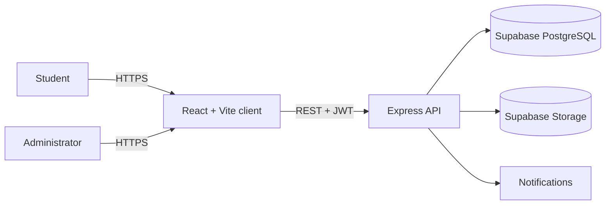

# Campus Complaint Tracker

> A transparent, role-based platform for reporting, tracking, and resolving campus issues.

<p align="center">
   <a href="https://campus-complaint-tracker-gamma.vercel.app"><strong>View the live application</strong></a>
   &nbsp;&middot;&nbsp;
   <a href="https://github.com/s7d4007/Campus-Complaint-Tracker/issues">Report an issue</a>
</p>

<p align="center">
   
   
   
   
   
</p>

## Overview

Campus Complaint Tracker gives students a reliable way to raise campus issues and follow them from submission to resolution. Administrators get a focused workspace for triage, assignment, status updates, communication, and activity analytics.

The result is a single, searchable source of truth for campus complaints instead of scattered messages, paper forms, and unclear follow-ups.

## Features

### For students

- Create an account and sign in securely.
- Submit complaints with category, priority, description, and images.
- Track complaint status and view full complaint history.
- Read and add comments on complaint details.
- Receive notifications when a complaint is assigned or its status changes.
- Delete complaints while they are still open.

### For administrators

- View every complaint in one management workspace.
- Filter complaints by status, category, priority, or title search.
- Assign complaints to administrators and move them into progress.
- Update complaints to `open`, `in_progress`, `resolved`, or `rejected`.
- Communicate with students through complaint comments.
- Review totals, trends, categories, priorities, and status analytics.

## How it works



1. A student registers or signs in.
2. The student submits a complaint with its category and priority.
3. The API validates the request and stores the complaint in PostgreSQL.
4. Optional images are uploaded to Supabase Storage and linked to the complaint.
5. An administrator reviews, assigns, comments on, and updates the complaint.
6. The student follows the progress through the dashboard, history, and notifications.

## Technology

| Layer | Technology |
| --- | --- |
| Frontend | React 18, React Router, Vite |
| Styling | Tailwind CSS, PostCSS |
| Data visualisation | Chart.js, react-chartjs-2 |
| Backend | Node.js, Express 5 |
| Database | PostgreSQL through Supabase |
| File storage | Supabase Storage |
| Authentication | JWT and bcryptjs |
| API client | Axios |
| Hosting | Vercel and Render |

## Project structure

```text
.
├── client/                 # React + Vite frontend
│   └── src/
│       ├── api/             # Axios API client
│       ├── components/      # Shared UI components
│       ├── context/         # Authentication state
│       └── pages/           # Student and admin screens
├── server/                 # Express REST API
│   ├── schema.sql           # Supabase database schema
│   └── src/
│       ├── config/          # Supabase client
│       ├── middleware/      # Authentication and role guards
│       └── routes/          # Auth, complaints, admin, comments, uploads
└── README.md
```

## API surface

All protected routes require a valid JWT. The backend is available under `/api`.

| Area | Routes |
| --- | --- |
| Health | `GET /health` |
| Authentication | `POST /api/auth/register`, `POST /api/auth/login`, `GET /api/auth/me` |
| Complaints | `GET /api/complaints`, `POST /api/complaints`, `GET /api/complaints/:id`, `PATCH /api/complaints/:id/status`, `DELETE /api/complaints/:id` |
| Comments | `GET /api/complaints/:id/comments`, `POST /api/complaints/:id/comments` |
| Notifications | `GET /api/notifications`, `PATCH /api/notifications/:id/read`, `PATCH /api/notifications/read-all` |
| Administration | `GET /api/admin/complaints`, `POST /api/admin/complaints/:id/assign`, `GET /api/admin/analytics`, `GET /api/admin/users` |
| Uploads | `POST /api/upload` |

## Run locally

### Prerequisites

- Node.js 18 or newer
- A Supabase project
- A Supabase Storage bucket named `complaint-images` configured as public

### 1. Clone the repository

```bash

cd Campus-Complaint-Tracker
```

### 2. Configure Supabase

Run [`server/schema.sql`](server/schema.sql) in the Supabase SQL Editor. Then create the `complaint-images` Storage bucket and set it to public.

Create `server/.env`:

```env
PORT=5000
SUPABASE_URL=https://your-project.supabase.co
SUPABASE_SERVICE_ROLE_KEY=your_service_role_key
JWT_SECRET=replace_with_a_long_random_secret
CLIENT_URL=http://localhost:5173
```

### 3. Start the API

```bash
cd server
npm install
npm run dev
```

The API will run at `http://localhost:5000`. Verify it with `http://localhost:5000/health`.

### 4. Start the client

In a second terminal:

```bash
cd client
npm install
npm run dev
```

Create `client/.env` if the API is not running at the default URL:

```env
VITE_API_URL=http://localhost:5000
```

Open the Vite URL shown in the terminal, normally `http://localhost:5173`.

## Build for production

Build the frontend with:

```bash
cd client
npm run build
```

Start the production API with:

```bash
cd server
npm start
```

For deployment, configure the same environment variables in the hosting provider. Point `CLIENT_URL` at the deployed frontend and `VITE_API_URL` at the deployed API URL.

## Security model

- Passwords are hashed with `bcryptjs` and are never returned to clients.
- Login sessions use signed JWTs with a seven-day expiration.
- Middleware protects authenticated routes and restricts administrator routes by role.
- New registrations are always created as students; users cannot self-promote to administrator.
- Students can only view and manage their own complaints.

## Roadmap

- Add automated API and frontend tests.
- Add email or push delivery for notifications.
- Add richer admin filters and pagination for large campuses.
- Add audit history for status and assignment changes.

## License

This project is released under the terms in [LICENSE](LICENSE).

## Acknowledgements

Built as a full-stack college project to explore React, Node.js, Express, PostgreSQL, REST APIs, authentication, file storage, and cloud deployment.